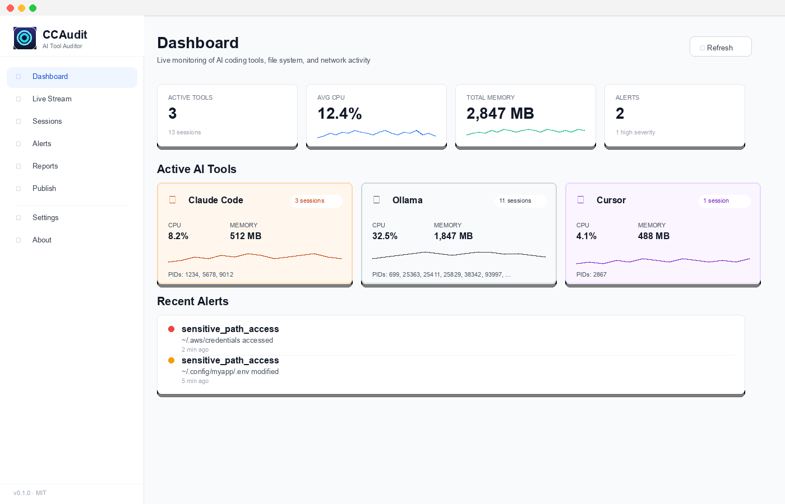
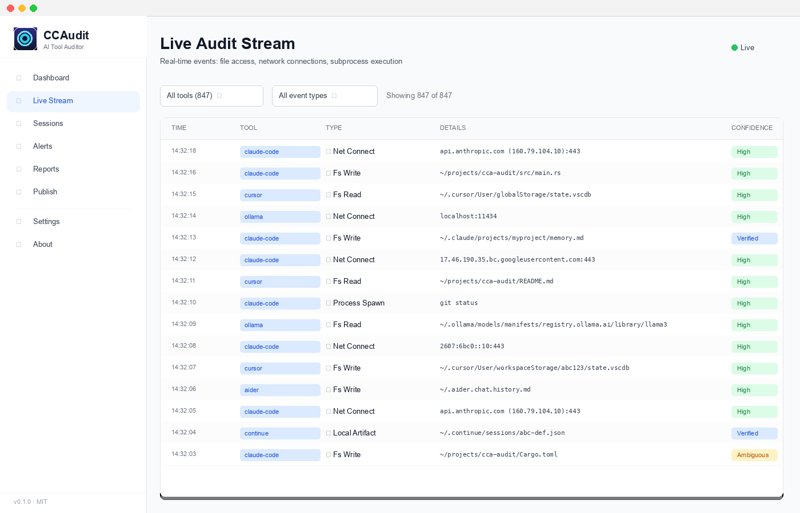
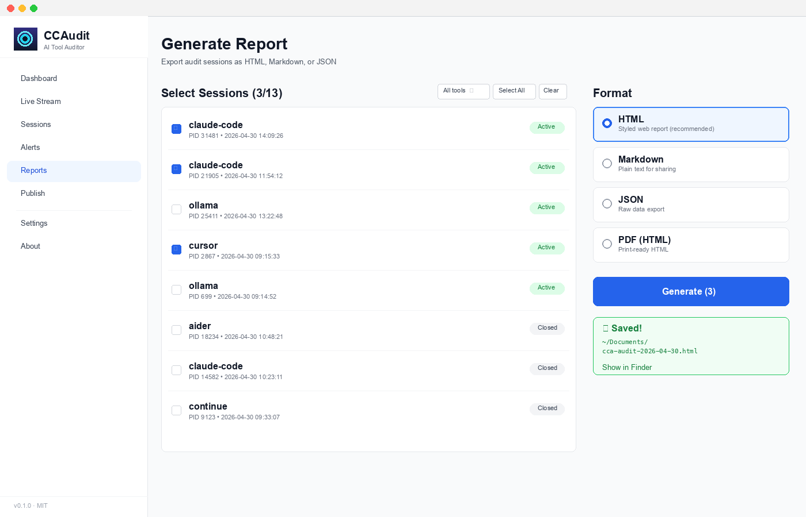
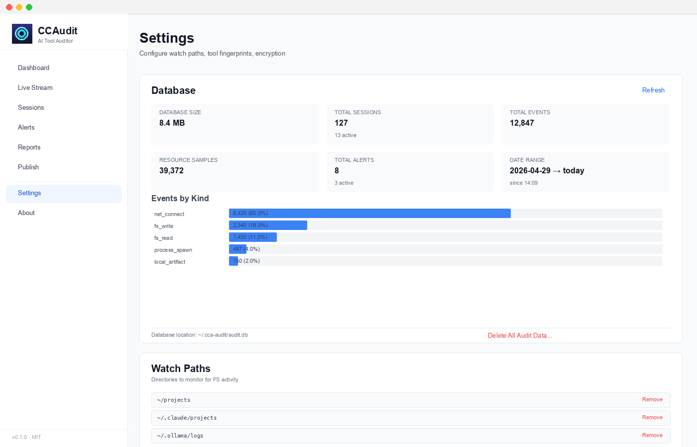
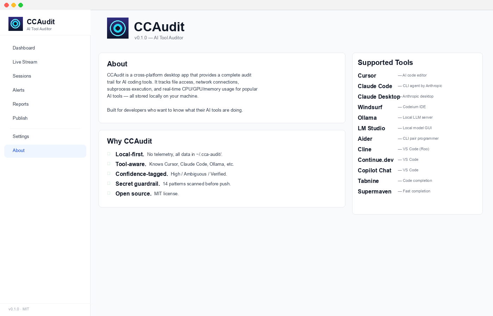

# CCAudit

A cross-platform desktop system-tray app that provides a complete audit trail for AI coding tools. Track file access, network connections, subprocess execution, and real-time resource usage (CPU/GPU/memory) for Cursor, Claude Code, Windsurf, Ollama, LM Studio, Aider, Cline, Continue, and more.

**Status:** Early development (v0.1.0). Expect frequent changes and bugs.

## Screenshots

### Dashboard — Per-tool tiles with live CPU/Memory sparklines



### Live Audit Stream — Real-time events with tool/kind filters



### Reports — Generate HTML, Markdown, JSON exports with native save dialog



### Settings — Database stats, watch paths, sensitive-path patterns



### About



## Why CCAudit?

AI coding tools operate with broad filesystem and network access. You may not know:
- Which files they actually read/write
- What remote hosts they connect to, how long, and how much data
- How much CPU/GPU/memory they consume in real time
- Whether they're respecting `.gitignore` or committing secrets

**Existing tools fall short:**
- ActivityWatch, WakaTime: process-level only, no file/network/resource audit
- Rewind, Glass, Cluely: pixel/OCR level, high resource overhead
- Helicone, Langfuse, AgentOps: require code instrumentation, blind to closed-source tools
- Process Explorer, htop: no audit trail, no AI-tool grouping

CCAudit closes the gap: **local-first audit trail** + **AI-tool classification** + **live resource monitoring** + **secret-safety guardrail**.

## Features

- **Live tray tooltip**: Real-time CPU%, memory, active tool count
- **Audit stream**: File writes/reads, network connections, subprocess spawns — per tool, confidence-tagged (High/Ambiguous)
- **Resource dashboard**: Per-tool CPU/GPU/memory sparklines, 1 Hz sampling with intelligent downsampling
- **Session history**: Group audit events into tool sessions; replay by tool/date/event type
- **Sensitive-path alerts**: Flag access to `~/.ssh`, `~/.aws`, `.env`, etc. with configurable severity
- **Report generation**: Export session audit as HTML/PDF/Markdown/JSON
- **Secret guardrail**: Pre-push scan with `gitleaks`; block secrets, show redacted findings, allow override with log
- **Cross-platform**: macOS (arm64 + x86_64), Windows, Linux (AppImage / Fedora rpm / Ubuntu deb)
- **Zero network egress**: All data stored locally in SQLite; no phone-home, no cloud

## Installation

### Pre-built binaries

Download the latest release from [GitHub Releases](https://github.com/masudjbd/cca-auditor/releases):

- **macOS**: `cca-audit.dmg` (arm64 and x86_64 universal binary)
- **Windows**: `cca-audit.msi`
- **Linux**: `cca-audit.AppImage` or `cca-audit.deb` (Ubuntu/Debian)

Double-click to install. On macOS, after first launch, the app will ask for accessibility permissions (required for process/FS monitoring).

### Build from source

**Requirements:**
- Rust 1.70+ (`rustup install stable`)
- Node 18+ and pnpm (`npm install -g pnpm`)
- Tauri CLI: `cargo install tauri-cli`

**macOS only:**
- Xcode Command Line Tools: `xcode-select --install`
- Optional: a paid Apple Developer ID if you want notarized binaries (for auto-updates)

**Steps:**

```bash
git clone https://github.com/masudjbd/cca-auditor
cd cca-auditor

# Install dependencies
pnpm install
cargo fetch

# Launch dev mode (auto-reload on file changes)
cargo tauri dev

# Build release binary (output in src-tauri/target/release/bundle/)
cargo tauri build
```

On first run, CCAudit downloads and SHA-256-verifies `gitleaks` binary to `~/.cca-audit/tools/` (one-time, ~50 MB).

## Quick start

1. Launch CCAudit from Applications (macOS) or Start menu (Windows), or run `./cca-audit` (Linux).
2. Click the tray icon → **Dashboard**: see active AI tools, CPU/MEM usage at a glance.
3. Click **Live** tab: watch audit events stream in real-time as you edit.
4. Click **Reports** → select a past session, choose format (HTML/PDF), click **Generate**.
5. When pushing to Git, use the **Publish** tab: if secrets are staged, CCAudit blocks and shows findings (redacted).

## Architecture

For technical details on crate structure, data flow, and attribution model, see [`docs/architecture.md`](docs/architecture.md).

### Crates

| Crate | Purpose |
|-------|---------|
| `auditor-core` | Domain types (events, sessions, resource samples, errors) |
| `auditor-db` | SQLite pool, schema, migrations, query layer |
| `auditor-detect` | Process enumeration, AI-tool classification against fingerprints |
| `auditor-monitors` | Main supervisor: spawns resource/fs/net/process monitors |
| `auditor-fs` | Cross-platform file-system watcher (`notify` + `FSEvents`/inotify/`ReadDirectoryChangesW`) |
| `auditor-net` | Network socket attribution (lsof/procfs/IP Helper + DNS resolution) |
| `auditor-report` | Report generation (Tera templates → HTML/PDF/Markdown/JSON) |
| `auditor-guardrail` | gitleaks integration, secret scanning, push guardrail |
| `auditor-ipc` | Tauri command handlers, event broadcast to frontend |
| `apps/desktop/src-tauri` | Tauri app shell, tray icon, migrations bootstrap |
| `apps/desktop/ui` | React 18 + TypeScript frontend (Vite, Tailwind, shadcn/ui) |

## Supported AI tools

| Tool | Support | Notes |
|------|---------|-------|
| Cursor | ✅ Full | VS Code fork; detects from binary path or `Cursor.app` |
| Claude Code | ✅ Full | Detects from CLI binary or npm entry point |
| Claude Desktop | ✅ Full | Detects from application bundle on macOS |
| Windsurf | ✅ Full | VS Code fork (Codeium); same as Cursor |
| Ollama | ✅ Full | Detects server process; polls `/api/ps` and `/api/tags` |
| LM Studio | ✅ Full | Detects `lm-studio` binary; polls localhost:1234 |
| Aider | ✅ Full | Detects from CLI entry point; monitors `.aider.*.history` |
| Cline (Roo) | ✅ Full | Detects from VS Code extension; monitors task JSON |
| Continue.dev | ✅ Full | Detects from extension; monitors sessions directory |
| GitHub Copilot Chat | ⚠️ Partial | Requires VS Code detection; no local artifact audit yet |
| Tabnine | ⚠️ Partial | Requires VS Code detection |
| Supermaven | ⚠️ Partial | Requires VS Code detection |
| Others | 🔧 Configurable | Add custom fingerprints to `config/tools.toml` |

To add a new tool: open an issue or submit a PR to `config/tools.toml` with your tool's process name, command-line patterns, and local artifact paths.

## Database

Data stored in `~/.cca-audit/db.sqlite` (or `~/.cca-audit/db.sqlite-encrypted` if SQLCipher enabled). No data leaves your machine.

Retention:
- Raw 1 Hz samples: 24 hours
- 10-second aggregates: 30 days
- 1-minute aggregates: 1 year
- Events: 30 days (configurable)

## Security & privacy

See [`SECURITY.md`](SECURITY.md) for vulnerability reporting and [`docs/threat-model.md`](docs/threat-model.md) for the full threat model.

**In brief:**
- Local-first: no cloud, no telemetry, no opt-in or opt-out needed
- Secret scanning: pre-push guardrail blocks staged secrets; org allowlist (masudjbd, fahiminfo only) prevents accidental pushes
- Process isolation: optional deep-audit mode on Linux (fanotify) and macOS (EndpointSecurity) requires explicit user enable
- Tauri sandboxing: minimal capabilities, no `shell:exec`, `fs` access only via IPC
- Auto-updater: notarized binaries signed with paid Apple Developer ID (macOS); SHA-256 pinned release artifacts

## Hashtags

Use these when discussing CCAudit on Twitter, Mastodon, GitHub Discussions:

- `#cursor-auditor`
- `#claude-auditor`
- `#llm-auditor`
- `#ollama-auditor`
- `#lmstudio-auditor`
- `#ai-coding-audit`
- `#ai-safety`

## Contributing

See [`CONTRIBUTING.md`](CONTRIBUTING.md) for contribution guidelines, dev setup, and how to add support for new tools.

## License

MIT License. See [`LICENSE`](LICENSE) for details.

---

Built by [Masudur Rahman](https://github.com/masudjbd) ([masudjbd@gmail.com](mailto:masudjbd@gmail.com)). Inspired by years of debugging "where did my 8 GB of RAM go?" and "did I just commit my AWS keys?".
# cca-auditor
